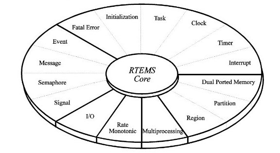

# RTEMS Mulitasking


### TO USE
```
# make the .c files if there are no .exe 
cd
make

# run the executable, which is at examples-v2/hello/hello_world_c/rtems-multitasking/code
QEMU_AUDIO_DRV=none qemu-system-arm -no-reboot -net none -M realview-pbx-a9 -m 256M -serial stdio -kernel examples-v2/hello/hello_world_c/rtems-multitasking/code/o-optimize/hello.exe
```

```
[root@centos7 code]# qemu-system-arm  -no-reboot -net none -nographic -smp 4 -icount auto -M realview-pbx-a9 -m 256M -kernel o-optimize/hello.exe
Write two tasks that use Timer Manager to schedule a function that should execute every 0.25 seconds. 

[ RTEMS shutdown ]
CPU: 0
RTEMS version: 6.0.0.671f126a3a8e6ce5da87aa75c7205fb764e95c78
RTEMS tools: 10.3.1 20210409 (RTEMS 6, RSB 889cf95db0122bd1a6b21598569620c40ff2069d, Newlib eb03ac1)
executing thread ID: 0x08a010001
executing thread name: UI1 
```


* Executive provides an interface to other system components such as interrupt
  handlers and device drivers. 

* System components may request the executive to allocate and coordinate
resources, and to wait for and trigger synchronizing conditions. 

* The executive system calls effectively extend the CPU instruction set to
  support efficient multitasking. By causing tasks to travel through
  well-defined state transitions, system calls permit an application to
  demand-switch between tasks in response to real-time events.

* By proper grouping of responses to stimuli into separate tasks, a system can
  now asynchronously switch between independent streams of execution, directly
  responding to external stimuli as they occur. This allows the system design
  to meet critical performance specifications which are typically measured by
  guaranteed response time and transaction throughput.

* By using the directives provided by RTEMS, the real-time applications
  developer is freed from the problem of controlling and synchronizing multiple
  tasks and processors. In addition, one need not develop, test, debug, and
  document routines to manage memory, pass messages, or provide mutual
  exclusion. 

* RTEMS provides the following set of services:



> About 32 bit or 64 bit:
> RTEMS was designed to make no assumptions concerning the characteristics of
> individual microprocessor families or of specific support hardware. 

### Good boy rtems

On Portability:
> The use of RTEMS allows the development of real-time applications which can
> be completely independent of a particular microprocessor architecture.

On Memory Usage:
> Features such as networking, various fileystems, and many other features are
> completely optional. This allows the application designer the flexibility to
> tailor RTEMS to most efficiently meet system requirements while still
> satisfying even the most stringent memory constraints. As a result, the size
> of the RTEMS executive is application dependent.

On definitions:
> A number of type definitions are provided by RTEMS and can be found in
> rtems.h.

In the RTEMS documentation, the presentation format for each directive includes 
the following sections:
* Calling Sequence
* Directive Status Codes
* Description
* Notes

## Key Concepts in RTEMS

1. Objects
2. Communication and Synchronization
3. Time
4. Memory Management

### Objects

RTEMS provides directives which can be used to dynamically create, delete, and
manupulate a set of predefined object types.

Objects: **task**, **message queues**, **semaphores**, **memory regions**, 
**memory partitions**, **timers**, **ports**, and **rate monotonic periods**.

All objects are created on the local node as required by the applications and
**have an RTEMS assigned ID**. All objects has a user-assigned name.
> The user-assigned name and RTEMS assigned ID are not identical.

Object names are completely arbitrary and selected by the user as a meaningful
"tag" which may commonly reflect the object’s use in the application.
Conversely, object IDs are designed to facilitate efficient object manipulation
by the executive.


### List of Data Types in Rtems

[All the data type](https://docs.rtems.org/doc-current/share/rtems/html/c_user/RTEMS-Data-Types-List-of-Data-Types.html#RTEMS-Data-Types-List-of-Data-Types)


### Tasks

The task manager provides a comprehensive set of directives to create, delete,
and administer tasks. The directives provided by the task manager are:

`rtems_task_create` - Create a task
`rtems_task_ident` - Get ID of a task
`rtems_task_self` - Obtain ID of caller
`rtems_task_start` - Start a task
`rtems_task_restart` - Restart a task
`rtems_task_delete` - Delete a task
`rtems_task_suspend` - Suspend a task
`rtems_task_resume` - Resume a task
`rtems_task_is_suspended` - Determine if a task is suspended
`rtems_task_set_priority` - Set task priority
`rtems_task_mode` - Change current task’s mode
`rtems_task_get_note` - Get task notepad entry
`rtems_task_set_note` - Set task notepad entry
`rtems_task_wake_after` - Wake up after interval
`rtems_task_wake_when` - Wake up when specified
`rtems_iterate_over_all_threads` - Iterate Over Tasks
`rtems_task_variable_add` - Associate per task variable
`rtems_task_variable_get` - Obtain value of a a per task variable
`rtems_task_variable_delete` - Remove per task variable

## Troubleshooting
1. While performing `make: 
    ```
    Nothing to be done for 'default_target'.`
    ```
- Remove the o-optimize folder `rm -rf o-optimize`
- Run `make` again

2. While perfoming make in the actual code we just wrote:
    ```
    make
    Makefile:14: /Makefile.inc: No such file or directory
    Makefile:16: /make/leaf.cfg: No such file or directory
    make: *** No rule to make target '/make/leaf.cfg'.  Stop.
    ```
    - Add the RTEMS_MAKEFILE_PATH=INSTALL_POINT/bspname/boardname
    
    ```
    export RTEMS_MAKEFILE_PATH=/home/aos-ubuntu/development/rtems/4.12/arm-rtems4.12/realview_pbx_a9_qemu/
    ```
    [Reference](https://devel.rtems.org/wiki/TBR/UserManual/Example_Application_Compiling)

3. When no qemu-...:
    ```
    export PATH=$HOME/development/rtems/4.12/bin:$PATH
    ```

